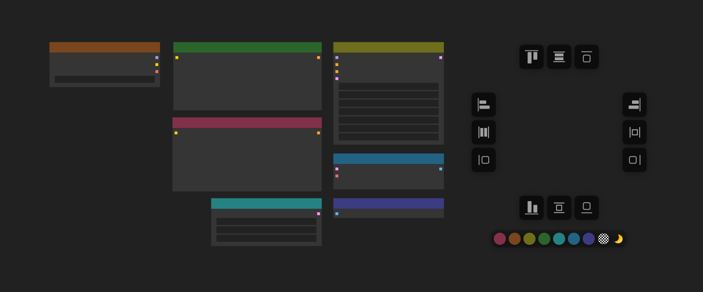

<div align="center">

<br><br>

[](README.md)
[](README_zh.md)
[](https://www.gnu.org/licenses/gpl-3.0.en.html)
[](https://github.com/Moooonet/Comfy-Align/issues)
</div>

---

A powerful node alignment and color management plugin for ComfyUI, designed to enhance your workflow efficiency


> *As a certified member of the OCD club, I realized ComfyUI needed a professional-grade alignment therapist (with optional color therapy sessions). So I decided to moonlight as a UX designer and developed this plugin. Fun fact: My name contains 'Moon', so I've shamelessly channeled my inner lunar deity by making the color picker icon a crescent moon.
> Fun fact: My name contains 'Moon', so I've shamelessly channeled my inner lunar deity by making the color picker icon a crescent moon.*


When using ComfyUI's native color feature, I noticed it dyes both the node's title bar and panel simultaneously. While this adds "color" and "bgcolor" parameters to the corresponding node in the workflow, the background of individual parameters remains unchanged (defaulting to dark gray). This can lead to two issues:
- Legibility problems where node titles or panel parameters become hard to read (especially with high-brightness or over-saturated colors)
- Ugly visual dissonance between parameter backgrounds and panel colors, creating aesthetically unbearable nodes

That's why this plugin's color management only changes the title bar background - making different nodes instantly distinguishable while maintaining workflow cleanliness. This design was inspired by Blender's approach.

Tested on ComfyUI Desktop - works smoother than a compulsively aligned grid. Happy pixel-perfecting!

### If this plugin helps preserve your sanity:
  ⭐ Star it to feed my coding addiction
  
  <a href='https://ko-fi.com/M4M21CRQOT' target='_blank'></a>


## Features

- **Node Alignment** - Align nodes to left, right, top, bottom, horizontal center, or vertical center
- **Node Stretching** - Stretch nodes to match dimensions or align to edges
- **Color Management** - Apply predefined colors to nodes or use custom colors
- **Intuitive UI** - Radial menu activated with Alt+A

## Installation

1. Clone this repository:
   ```bash
   cd ComfyUI/custom_nodes

   git clone https://github.com/Moooonet/Comfy-Align.git
   ```
2. Restart ComfyUI

## Usage

1. Select two or more nodes in your ComfyUI workspace
2. Press `Alt+A` to activate the alignment menu
3. Click on the desired action icon

## Details

### Basic Alignment

- **Left Alignment** - Aligns all selected nodes to the leftmost edge
- **Right Alignment** - Aligns all selected nodes to the rightmost edge
- **Top Alignment** - Aligns all selected nodes to the top edge
- **Bottom Alignment** - Aligns all selected nodes to the bottom edge
- **Horizontal Center** - Distributes nodes horizontally with equal spacing
- **Vertical Center** - Distributes nodes vertically with equal spacing

### Node Stretching

- **Left Stretch** - Stretches nodes to the left edge. If already left-aligned, equalizes widths by adjusting the right side
- **Right Stretch** - Stretches nodes to the right edge. If already right-aligned, equalizes widths by adjusting the left side
- **Top Stretch** - Stretches nodes to the top edge. If already top-aligned, equalizes heights by adjusting the bottom side
- **Bottom Stretch** - Stretches nodes to the bottom edge. If already bottom-aligned, equalizes heights by adjusting the top side
- **Horizontal Stretch** - Makes all nodes the same width as the widest node
- **Vertical Stretch** - Makes all nodes the same height as the tallest node

### Color Management

The plugin includes predefined colors:

| Color | Hex Code | Description |
|-------|----------|-------------|
| 🔴 | #83314a | Red |
| 🟠 | #79461d | Orange | 
| 🟡 | #6e6e1d | Yellow |
| 🟢 | #2b652b | Green |
| 🔵 | #248382 | Cyan |
| 🔵 | #246283 | Blue |
| 🟣 | #3c3c83 | Purple |
| ♟️ | - | Chessboard (removes color) |
| 🌙 | - | Moon (for custom colors) |

## Configuration

The default shortcut key is `Alt+A`. If you want to modify the shortcut key and other configurations, you can edit the CONFIG object in the align.js file:

```javascript
const CONFIG = {
  iconSize: 36,        // icon size
  spacing: 112,        // icon spacing
  colors: {
    circle1: '#83314a',  // red
    circle2: '#79461d',  // orange
    circle3: '#6e6e1d',  // yellow
    circle4: '#2b652b',  // green
    circle5: '#248382',  // cyan
    circle6: '#246283',  // blue
    circle7: '#3c3c83',  // purple

    moon: 'linear-gradient(135deg, #ffd700, #ffb700, #ffd700, #fff6a9)',  // moon icon gradient color
    icon: 'rgba(198, 198, 198, 0.8)',  // icon color
    bg: 'rgba(12, 12, 12, 0.95)',      // background color
    hover: 'rgba(255,255,255,0.2)'     // hover color
  },
  transition: 'all 0.2s ease',  // animation transition effect
  shortcutKey: 'a',             // shortcut key
  shortcutModifier: 'alt'       // shortcut modifier key
};
```

## Sponsor
<div align="center">
  
</div>


## License

Comfy-Align is licensed under the GNU General Public License v3.0 (GPL-3.0). See the LICENSE file for details.

